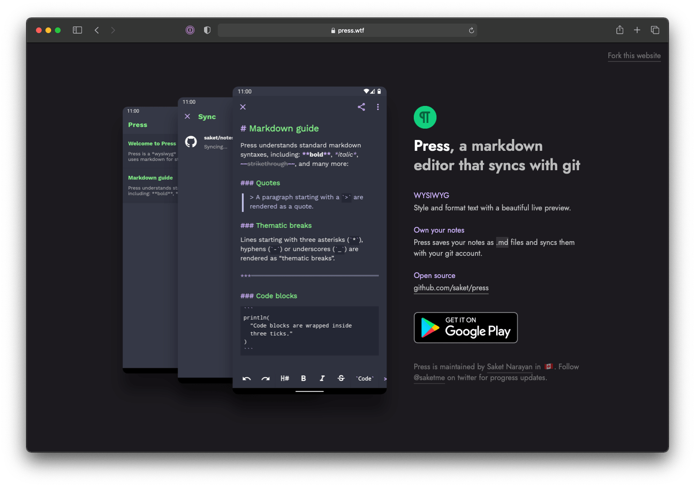

### https://press.wtf

Landing page for [press](https://github.com/saket/press) written using [zola](https://getzola.org).

Feel free to use this for your own app's website. This theme was written by a CSS noob so things may not be perfect. I wrote my own theme because I couldn't find anything remotely good looking despite searching for weeks. 

### Usage
```shell
git clone git@github.com:saket/press-website.git && cd press-website
brew install zola
zola serve
```

### License
```
Copyright 2021 Saket Narayan.

Licensed under the Apache License, Version 2.0 (the "License");
you may not use this file except in compliance with the License.
You may obtain a copy of the License at

   http://www.apache.org/licenses/LICENSE-2.0

Unless required by applicable law or agreed to in writing, software
distributed under the License is distributed on an "AS IS" BASIS,
WITHOUT WARRANTIES OR CONDITIONS OF ANY KIND, either express or implied.
See the License for the specific language governing permissions and
limitations under the License.
```
